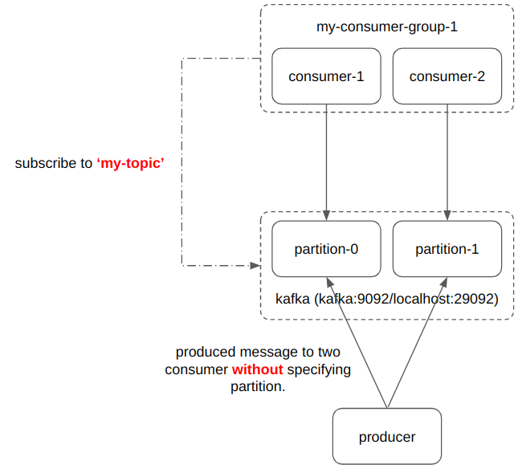
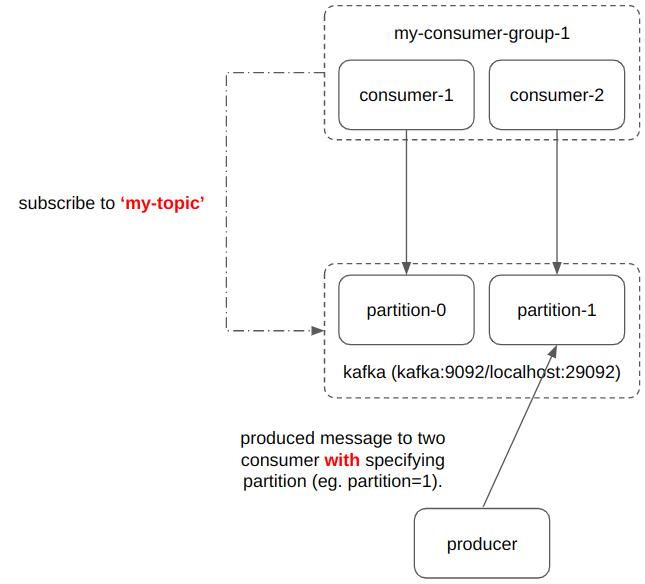
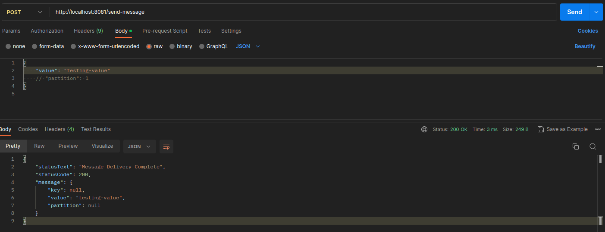
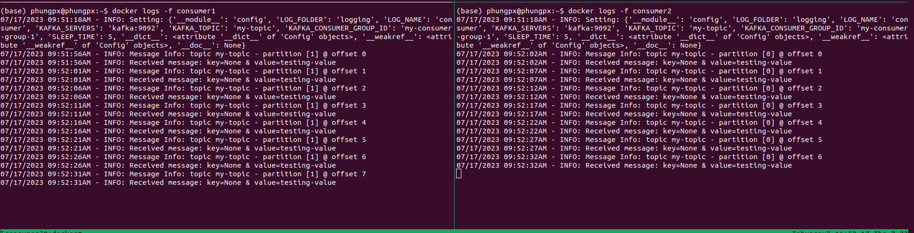
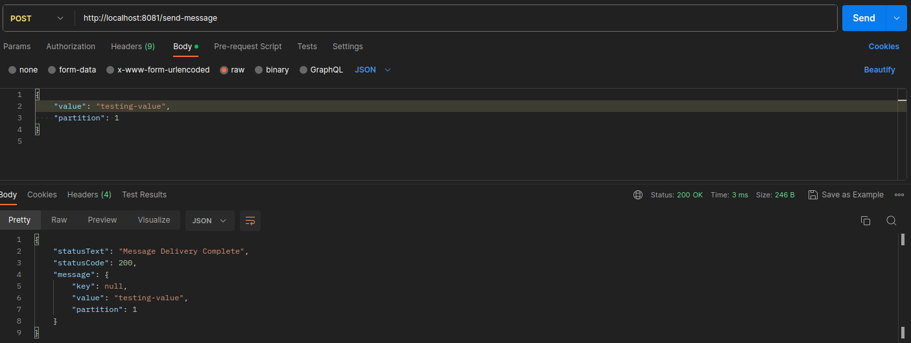
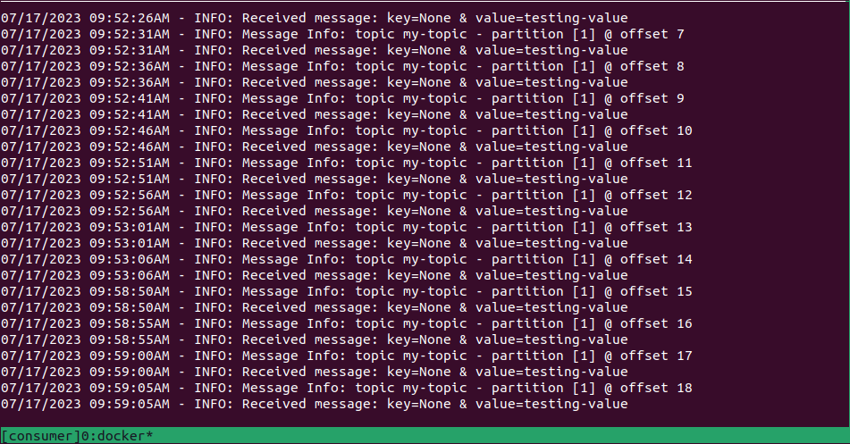
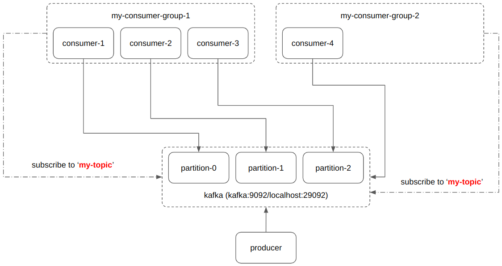
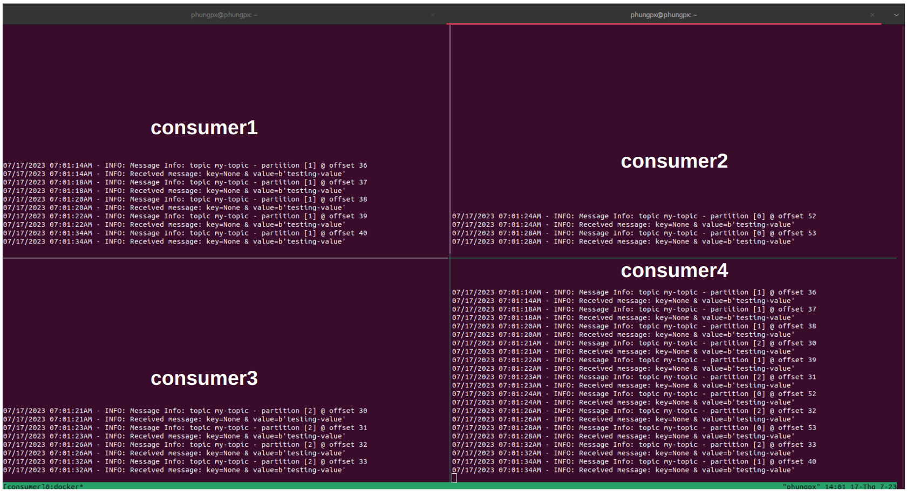

# Confluent Kafka Practice
Contributor: @phungpx
Technologies: Apache Kafka, FastAPI, Docker, Docker Compose

## Cleaner for Ubuntu Server

You are using Ubuntu Server, someday you notice that the server is running out of space. To help keep your space under control. Here are some steps you might need to do every month.

### Clean pip's cache

```Shell
pip cache purge
```

### Clean Anaconda's cache

```Shell
conda clean -a
```

### Clean Docker

This will remove:

- all stopped containers
- all networks not used by at least one container
- all images without at least one container associated to them
- all build cache

```Shell
sudo docker system prune -a
```

## Environment Setup

- Create virtual environment

```
cd producer
python -m venv <environment-name>
```

```
cd consumer
python -m venv <environment-name>
```

- Activate virtual environemtn

```
cd producer
source <environment-name>/bin/activate
```

```
cd consumer
source <environment-name>/bin/activate
```

- Install all dependencies

```
cd producer
pip install -r requirements.txt
```

```
cd consumer
pip install -r requirements.txt
```

## Usage

### 1.1 Case 1 - One consumer group (with two consumers) id and One producer (Development Mode)

- Acitvate all crucial services including kafka, kafka-ui, zookeeper

```
docker compose -f dev.docker-compose.yml up
```

- Producer with creating a topic name `my-topic` and `2` partitions

```
cd producer
```

```
# Activate virual environment
python -m venv .venv
source .venv/bin/activate

# Install all dependencies
pip install --upgrade pip
pip install -r requirements.txt
```

```
chmod +x run.sh
KAFKA_TOPIC=my-topic KAFKA_TOPIC_PARTITIONS=2 KAFKA_REPLICATION_FACTOR=1 ./run.sh
```

- Run 2 different consumers in 2 different command pannels

```
cd consumer
```

```
# Activate virual environment
python -m venv .venv
source .venv/bin/activate

# Install all dependencies
pip install --upgrade pip
pip install -r requirements.txt
```

```
# terminal pannel 1
cd consumer
KAFKA_TOPIC=my-topic KAFKA_CONSUMER_GROUP_ID=my-topic-group-1 KAFKA_TOPIC=my-topic python consumer

```

```
# terminal pannel 2
cd consumer
KAFKA_TOPIC=my-topic KAFKA_CONSUMER_GROUP_ID=my-topic-group-1 python consumer

```

- Produce message through endpoint `/send-message`

```
URL: http://localhost:8081/send-message
Method: POST
Body:
{
    "value": "testing-value"  (message being produced to consumers)
    // "partition": None  (specify partition receiving produced messages)
}
```

| Requested Body                      | Visualization                                                          |
| ----------------------------------- | ---------------------------------------------------------------------- |
| {value: string, partition: None}    |  |
| {value: string, partition: int = 1} |    |

| Send request (partition=None)                                 |
| ------------------------------------------------------------- |
|  |

| Consume messages (partition=None)                             |
| ------------------------------------------------------------- |
|  |

| Send request (partition=1)                                                |
| ------------------------------------------------------------------------- |
|  |

| Consume messages (partition=1, online consumed by consumer which belongs to partition 1) |
| ---------------------------------------------------------------------------------------- |
|                 |

### 1.2 Case 1 - One consumer group (with two consumers) id and One producer (Production Mode)

- Run multiple docker compose files (https://stackoverflow.com/questions/62871280/should-i-have-multiple-docker-compose-files)

- Activate all crucial services

```
docker compose -f dev.docker-compose.yml up
```

- Run producer and consumers

```
docker compose -f case1.docker-compose.yml up
```

- Produce message through endpoint `/send-message`

```
URL: http://localhost:8081/send-message
Method: POST
Body:
{
    "value": "testing-value"  (message being produced to consumers)
    // "partition": None  (specify partition receiving produced messages)
}
```

### 2 Case 2 - Two consumer groups (group 1 - 3 partitions and group 2- 1 parititon)

- Activate all crucial services

```
docker compose -f dev.docker-compose.yml up
```

- Run producer and consumers

```
docker compose -f case2.docker-compose.yml up
```

- Produce message through endpoint `/send-message`

```
URL: http://localhost:8081/send-message
Method: POST
Body:
{
    "value": "testing-value"  (message being produced to consumers)
    // "partition": None  (specify partition receiving produced messages)
}
```

| Visualization (partition=None)                             |
| ---------------------------------------------------------- |
|  |

| Consume messages (partition=None)                             |
| ------------------------------------------------------------- |
|  |
